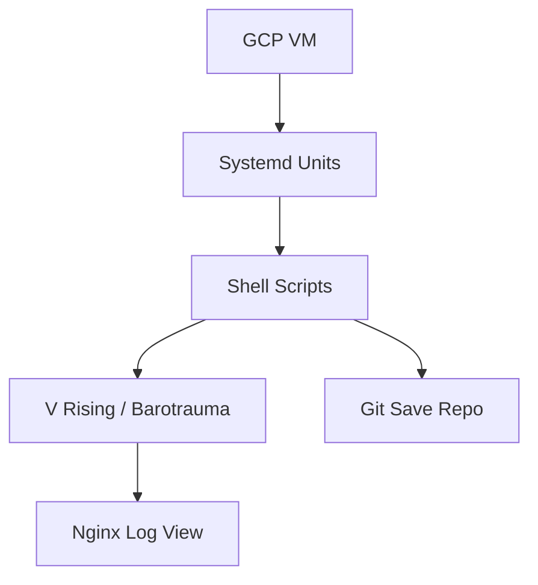

# 🧠 Baroboys AI Primer: Vision & Meta-Goals

Baroboys is a modular game server orchestration platform—part DevOps playground. It blends repeatable infrastructure with expressive automation, giving each server memory, lifecycle, and recovery.

The system supports multiple games (e.g. *V Rising*, *Barotrauma*) under a unified orchestration layer. It uses Terraform to provision GCP VMs, Packer to bake layered images, and systemd + shell scripts to coordinate startup, shutdown, and state capture.

---

## 🌌 Operating Philosophy

Baroboys servers are: composable, inspectable, and resilient. A game world isn't just launched—it spins up with a boot history, commits its memory to Git, and sleeps gracefully when commanded.

You don't babysit it; you steer it.

---

## ♻️ Game-Aware Modularity

Systemd units manage lifecycles.

Each game world defines its own startup parameters, save behavior, and logging footprint.

---

## 🛠️ Image Layering Strategy

Baroboys uses Packer to build layered GCE images:

* **Core layer**: Common runtime tools (shell orchestration, systemd services, gcloud monitoring)
* **Admin layer**: Admin server and SteamCMD
* **Game layer**: Install or update game binaries and register services Wine and xvfb

This model minimizes rebuilds and allows rapid iteration or hotfixes by Git + restart.

---

## ⚙️ Operational Flow

### Startup (e.g., V Rising)

```
📱 GCP VM heartbeat received
🌐 xvfb + Wine initialized
🧬 Active game: V Rising
🔄 AutoSave_1472.save.gz restored
🔗 Git commit history intact
🕒 Ready in 41s
```

### Shutdown (e.g., V Rising)

```
📣 In-game: "Server shutting down in 60s"
🧠 game-shutdown.service triggered (Before=halt.target)
📂 save_game.sh → setup_vrising.sh (or setup_barotrauma.sh)
🔗 Git commit: "Autosave @ 2025-05-28 05:21 UTC"
🚁 Pushed upstream
🔺 VM idle, safe to terminate
```

> **Note:** These sequences are *illustrative design goals*, not literal logs.

---

## 🔐 Secrets and Observability

* `.htpasswd` is pulled securely via GCP Secret Manager at runtime
* Nginx serves the log directory at `http://[SERVER_EXTERNAL_IP]:8080/logs/`
* Auth protected via Basic Auth (`/etc/nginx/.htpasswd`)
* File system permissions are adjusted to expose logs without overexposure
* Log directory: `/home/bwinter_sc81/baroboys/VRising/logs/`, `/var/log/baroboys/`
* Typical logs:

    * `VRisingServer.log`
    * `game-startup.log`
    * `game-shutdown.log`

Nginx config is managed via `scripts/dependencies/nginx/apt_refresh.sh`, and registered as a site via `/etc/nginx/sites-available/vrising-admin`.

---

## 🛌 Idle Shutdown Strategy

Baroboys supports automatic shutdown of idle game servers.

* **Resource-aware**: Use CPU thresholds after N minutes with idle activity

These integrate with the existing `game-shutdown.service` and respect per-game shutdown protocols.

---

## 🔺 Teardown Pipeline Summary

1. `game-shutdown.service` runs *before* VM halts
    1. Executes `$HOME/baroboys/scripts/services/<GAME>/shutdown.sh`
        1. Game server is gracefully shut down
        2. Save committed to Git and pushed upstream
2. VM shutdown occurs

---

## ⚖️ System Diagram (Mermaid)

