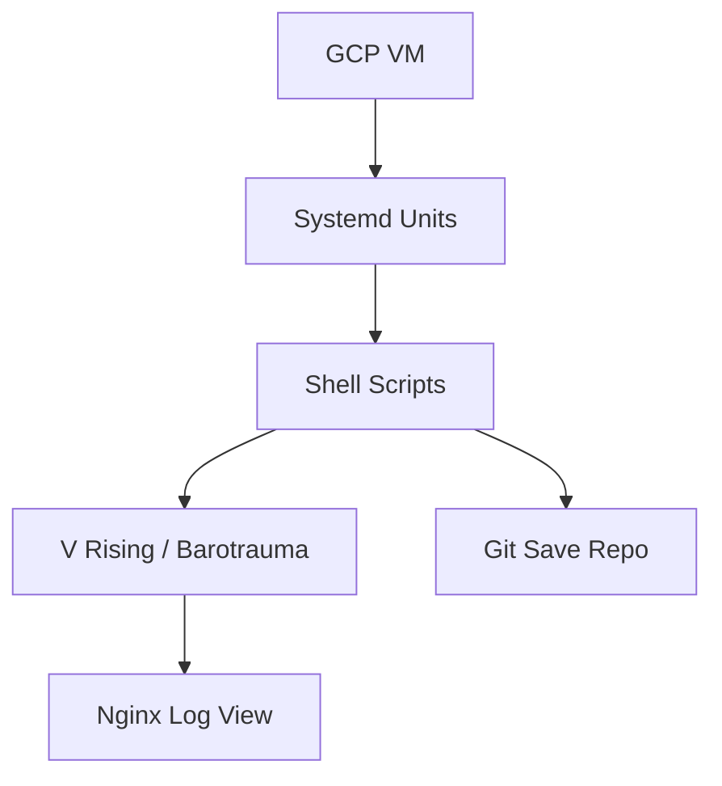

# 🧠 Baroboys AI Primer: Vision & Meta-Goals

Baroboys is a modular game server orchestration platform—part DevOps playground, part narrative simulation. It blends repeatable infrastructure with expressive automation, letting each server behave like a system with memory, lifecycle, and recovery.

The system supports multiple games (e.g. *V Rising*, *Barotrauma*) under a unified orchestration layer. It uses Terraform to provision GCP VMs, Packer to bake layered images, and systemd + shell scripts to coordinate startup, shutdown, and state capture—like a playable cluster node.

---

## 🌌 Operating Philosophy

Baroboys treats servers like vessels: composable, inspectable, and resilient. A game world isn't just launched—it spins up with a boot history, commits its memory to Git, and sleeps gracefully when commanded.

You don't babysit it; you steer it.

---

## ♻️ Game-Aware Modularity

Game-specific behavior is governed by an `.envrc` flag: `ACTIVE_GAME=vrising` (or `barotrauma`). A shared dispatcher (
`save_game.sh`) uses this to invoke the correct setup/teardown script:

* `setup_vrising.sh` launches Wine + xvfb, installs or updates the game, links configs, and starts `vrising.service`
* `setup_barotrauma.sh` installs game assets and links save/config paths to expected Steam locations

Systemd units manage lifecycles:

* **V Rising**: Fully automated via `vrising.service`
* **Barotrauma**: Currently launched via `screen`; systemd unit pending

Each game world defines its own startup parameters, save behavior, and logging footprint.

---

## 🛠️ Image Layering Strategy

Baroboys uses Packer to build layered GCE images:

* **Core image**: Common runtime tools (Wine, SteamCMD, xvfb, shell orchestration, systemd services)
* **Game layer**: Runtime setup scripts run at VM start to pull configs, install or update binaries, and register services

This model minimizes rebuilds and allows rapid iteration or hotfixes by Git + restart.

---

## ⚙️ Operational Flow

### Startup

```
📱 GCP VM heartbeat received
🌐 xvfb + Wine initialized
🧬 Active game: V Rising
🔄 AutoSave_1472.save.gz restored
🔗 Git commit history intact
🕒 Ready in 41s
```

### Shutdown

```
📣 In-game: "Server shutting down in 60s"
🧠 game-shutdown.service triggered (Before=halt.target)
📂 save_game.sh → setup_vrising.sh (or setup_barotrauma.sh)
🔗 Git commit: "Autosave @ 2025-05-28 05:21 UTC"
🚁 Pushed upstream
🔺 VM idle, safe to terminate
```

> **Note:** These sequences are *illustrative design goals*, not literal logs.

---

## 🔐 Secrets and Observability

* `.htpasswd` is pulled securely via GCP Secret Manager at runtime
* Nginx serves the log directory at `http://[SERVER_EXTERNAL_IP]:8080/logs/`
* Auth protected via Basic Auth (`/etc/nginx/.htpasswd`)
* File system permissions are adjusted to expose logs without overexposure
* Log directory: `/home/bwinter_sc81/baroboys/VRising/logs/`
* Typical logs:

    * `VRisingServer.log`
    * `startup.log`
    * `shutdown.log`

Nginx config is managed via `apt_nginx.sh`, and registered as a site via `/etc/nginx/sites-available/vrising-admin`.

---

## 🛌 Planned: Idle Shutdown Strategy

Baroboys will eventually support automatic shutdown of idle game servers. Options under exploration:

* **Player-aware**: Poll RCON or internal APIs to detect 0-player state
* **Resource-aware**: Use CPU/network/memory thresholds over time
* **Time-aware**: Shutdown after N minutes without save activity or inbound connections

These will integrate with the existing Git-backed `game-shutdown.service` and will respect per-game shutdown protocols.

---

## 🔺 Teardown Pipeline Summary

1. `game-shutdown.service` runs *before* VM halts
2. Executes `/root/baroboys/scripts/teardown/shutdown.sh`
3. Calls `save_game.sh` (game-aware)
4. Delegates to `setup_<game>.sh` for teardown
5. Save committed to Git and pushed upstream
6. System logs flushed to Nginx-visible path

---

## 📘 Future Enhancements

* Migrate Barotrauma to `barotrauma.service` (mirroring `vrising.service`)
* Add idle-checking `autosleep.service`
* Develop `log_summary.sh` to extract recent activity, user events, crash signatures
* Introduce manifest-driven game config (`games.conf`) for easier extensibility
* Add `status_report.sh` to generate human-readable summaries of last boot/save

---

## ⚖️ System Diagram (Mermaid)

