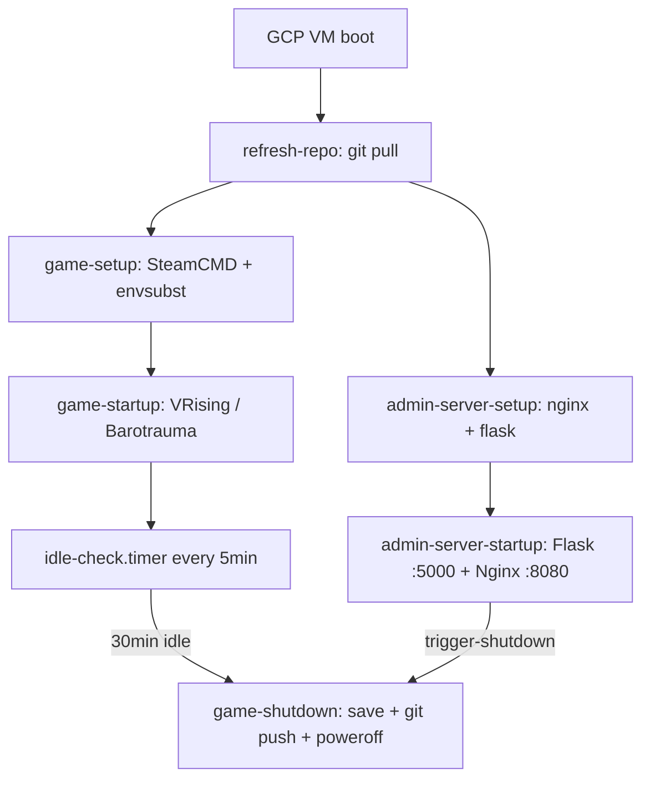

# Baroboys AI Primer

Baroboys is a GCP game server hosting platform for **V Rising** and **Barotrauma**. It blends
repeatable infrastructure with expressive automation — each server boots from a Packer image,
pulls the latest repo, runs systemd-managed services, commits save state to Git on shutdown,
and powers off. Near-zero cost when idle.

**For a full system map, see [`docs/architecture.md`](architecture.md).**

---

## Operating Philosophy

Servers are: composable, inspectable, and cost-aware.

A game world isn't just launched — it spins up with a cloned repo, runs from baked images,
commits its memory to Git, and shuts down gracefully. You don't babysit it; you steer it.

---

## Key Facts

| Item | Value |
|------|-------|
| GCP project | `europan-world` |
| VM name | `europa` |
| Zone | `us-west1-c` |
| Machine type | `n2-custom-2-6144` |
| VM user | `bwinter_sc81` |
| TF state | `gs://tf-state-baroboys/terraform/prod` |
| Service account | `vm-runtime@europan-world.iam.gserviceaccount.com` |
| Admin panel | `http://<VM-IP>:8080/` (user: `Hex`, pw: server-password) |

---

## Image Layering

```
debian-12 → baroboys-core → baroboys-admin → baroboys-barotrauma
                                           └→ baroboys-vrising
```

- **core**: git, gcloud, Ops Agent, refresh-repo service
- **admin**: Nginx (:8080), SteamCMD, Flask admin server (:5000), idle-check timer
- **barotrauma**: Barotrauma native Linux server (Steam app 1026340)
- **vrising**: Xvfb + WineHQ + VRising Windows server (Steam app 1829350)

---

## Boot Sequence (brief)

1. GCE runs startup-script → `systemctl start game-startup.service`
2. `refresh-repo-startup` pulls latest Git for root and `bwinter_sc81`
3. `game-setup` (root): updates game via SteamCMD, fetches `server-password` secret, runs `envsubst` on config templates
4. `game-startup` (bwinter_sc81): runs the game process
5. `admin-server-startup` (root): Flask on :5000; Nginx on :8080 proxies `/api/*` to Flask
6. `idle-check.timer`: fires every 5 min, auto-shuts down after 30 min CPU < 5%

---

## Shutdown Sequence (brief)

Triggered by admin panel, idle-check, or VM stop metadata.

1. `game-shutdown.service` → `shutdown.sh`
2. Notify players (VRising: mcrcon), kill game process, wait for clean exit
3. Compress/stage save file
4. `git commit` → `git pull --rebase` → `git push origin main`
5. `sudo systemctl poweroff`

---

## Secrets (GCP Secret Manager)

| Secret | Purpose |
|--------|---------|
| `github-deploy-key` | ECDSA SSH key to clone/pull private repo on boot |
| `server-password` | Game join + RCON password (injected via `envsubst` into server configs) |
| `nginx-htpasswd` | Basic auth for admin panel |

---

## Admin Panel

- External URL: `http://<VM-IP>:8080/` (from `terraform output admin_server_url`)
- Nginx handles auth and serves static files; proxies `/api/*` to Flask on `127.0.0.1:5000`
- Flask app: `scripts/services/admin_server/src/admin_server.py`
- On-VM install: `/opt/baroboys/admin_server.py` + `/opt/baroboys/static/`
- `status.json` is written by `idle_check.sh` every 5 min and served directly by Nginx

**Local dev:** `make admin-local` (runs Flask + Nginx locally, mirrors prod layout)

---

## Observability

- Logs: `/var/log/baroboys/` (startup, shutdown, idle_check, admin_server, xvfb logs)
- VRising game log: `/home/bwinter_sc81/baroboys/VRising/logs/VRisingServer.log`
- Ops Agent ships metrics and journald logs to GCP Cloud Logging/Monitoring
- Admin panel streams any log via `GET /api/logs/<name>`

---

## Teardown

```
game-shutdown.service
  └── shutdown.sh
        ├── gracefully stop game
        ├── git commit save state
        ├── git push origin main
        └── sudo systemctl poweroff
```

---

## Mermaid Overview


```mermaid
flowchart TD
    GCP[GCP VM boot] --> RefreshRepo[refresh-repo: git pull]
    RefreshRepo --> Setup[game-setup: SteamCMD + envsubst]
    RefreshRepo --> AdminSetup[admin-server-setup: nginx + flask]
    Setup --> Game[game-startup: VRising / Barotrauma]
    AdminSetup --> Admin[admin-server-startup: Flask :5000 + Nginx :8080]
    Game --> IdleCheck[idle-check.timer every 5min]
    IdleCheck -->|30min idle| Shutdown[game-shutdown: save + git push + poweroff]
    Admin -->|trigger-shutdown| Shutdown
```